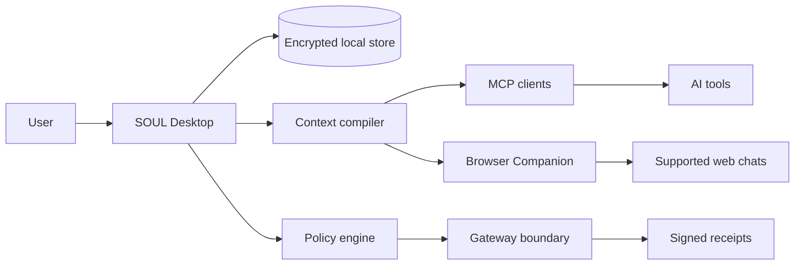

<div align="center">
  <h1>SOUL</h1>
  
  <p><strong>A local-first identity and policy runtime for AI tools.</strong></p>
  <p>SOUL keeps a portable, inspectable model of your preferences, decisions, goals, and boundaries on your device, then compiles only the context required for each task.</p>
  <p>
    <a href="#quick-start">Quick start</a> ·
    <a href="#architecture">Architecture</a> ·
    <a href="docs/README.md">Documentation</a> ·
    <a href="CONTRIBUTING.md">Contributing</a>
  </p>
</div>

> [!IMPORTANT]
> SOUL is an early-stage research prototype. The desktop runtime, local data layer, context compiler, policy engine, MCP integration, and Browser Companion are implemented. The current Gateway demonstrates policy-controlled execution locally; it does not yet control arbitrary external services.

## Why SOUL

AI products build separate, opaque representations of the same person. Preferences drift between tools, private context is often disclosed too broadly, and users have little evidence that personalization actually improves an answer.

SOUL provides a user-owned layer between a person and the AI clients they already use:

- **Local-first identity**: preferences, decisions, goals, facts, and boundaries remain in an encrypted local store.
- **Purpose-scoped context**: the runtime selects and packages only information relevant to the current task.
- **Provider portability**: the same profile can support coding clients through MCP and supported web chats through the Browser Companion.
- **Inspectable provenance**: inferred information remains reviewable, correctable, and attributable to its source.
- **Measurable personalization**: blind preference evaluations compare SOUL-assisted responses against a reviewed baseline.
- **Deterministic policy checks**: explicit rules can allow, deny, or require confirmation before a mediated action proceeds.

## Product Principles

| Principle           | What it means                                                                                 |
| ------------------- | --------------------------------------------------------------------------------------------- |
| User ownership      | Export and deletion are core capabilities, not premium features.                              |
| Minimal disclosure  | Context is compiled for a specific purpose instead of exposing the entire profile.            |
| Explicit control    | Sensitive inferences require review; high-impact actions fail closed.                         |
| Provider neutrality | SOUL complements existing AI clients rather than replacing them with another chat interface.  |
| Verifiable behavior | Personalization and policy decisions are evaluated with repeatable tests and signed receipts. |

## Architecture



SOUL is split across a Tauri desktop application, a Rust runtime, shared TypeScript schemas, local MCP and native-messaging sidecars, and a Chromium Browser Companion.

## Current Capabilities

| Area                                                                               | Status                  |
| ---------------------------------------------------------------------------------- | ----------------------- |
| Guided local profile creation and calibration                                      | Implemented             |
| Typed entities and candidate review                                                | Implemented             |
| SQLCipher-backed local storage and FTS5 search                                     | Implemented             |
| Task-specific context compilation                                                  | Implemented             |
| MCP integration for supported coding clients                                       | Implemented             |
| Browser Companion for supported Chromium web chats                                 | Implemented             |
| Blind preference evaluation                                                        | Implemented             |
| Deterministic policy engine                                                        | Implemented             |
| Signed local export, restore, and deletion flows                                   | Implemented             |
| Windows packaging and release smoke tests                                          | Implemented             |
| Production service connectors and credential isolation                             | Planned                 |
| Signed updates, cross-platform release validation, and external product validation | Required before release |

See [Production Readiness](docs/operations/production-readiness.md) for the complete release boundary.

## Quick Start

### Prerequisites

- Node.js `26.4.0`
- pnpm `11.12.0`
- Rust `1.97.1`
- Windows with the MSVC toolchain for the complete desktop release path

### Development

```bash
pnpm install
pnpm dev
```

Run the web interface without the Tauri shell:

```bash
pnpm dev:web
```

### Quality Checks

```bash
pnpm typecheck
pnpm lint
pnpm test
pnpm build
pnpm build:companion
```

The complete Windows release gate builds the sidecars, runs Rust and TypeScript checks, assembles the NSIS installer, and performs an installation smoke test:

```bash
pnpm release:check
```

## Repository Layout

```text
browser/              Chromium Browser Companion
docs/                 Product, operations, validation, and project history
packages/soul-schema/ Shared domain contracts
scripts/              Build, packaging, and release verification
src/                  React desktop interface
src-tauri/            Rust runtime, storage, policies, bridge, and sidecars
tests/                TypeScript unit and integration tests
```

## Security Model

SOUL treats imported content, browser content, model output, and integration payloads as untrusted input. Privileged operations are implemented behind narrow Rust commands, policy evaluation is deterministic on the hot path, and sensitive local capabilities are protected with platform facilities where implemented.

The current security boundary is intentionally narrow: policy enforcement is binding only when execution passes through a SOUL-controlled path. See [Security](SECURITY.md) and [External Blockers](docs/EXTERNAL_BLOCKERS.md) for current limitations.

## Documentation

- [Documentation index](docs/README.md)
- [Product strategy and architecture](docs/product/product-strategy-and-architecture.md)
- [P0 product specification](docs/product/p0-product-specification.md)
- [Production readiness](docs/operations/production-readiness.md)
- [Validation program](docs/validation/P0_VALIDATION_PLAYBOOK.md)
- [Development history](docs/development-history/README.md)

## Project Status

SOUL is under active development and is not currently offered as a production release. External validation, release signing, secure updates, legal review, and additional platform verification remain open gates.

## License

Copyright © 2026 SOUL. All rights reserved. This repository is currently proprietary and does not grant a license to use, modify, or redistribute the software.
